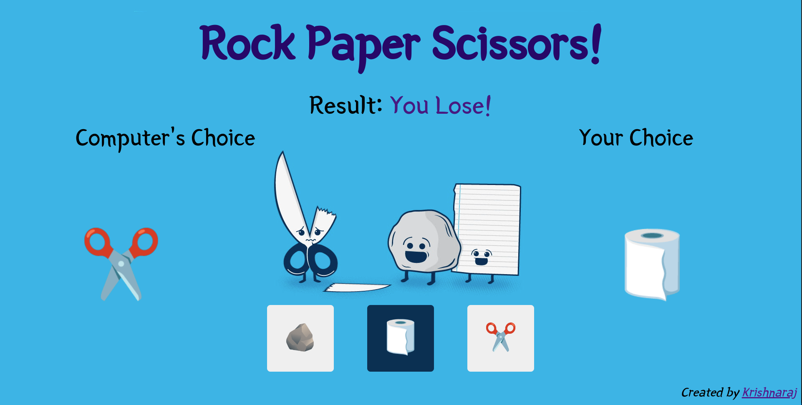
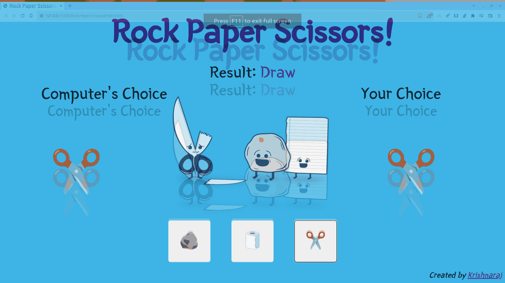

# Rock-Paper-Scissors
A Simple Website to Play Rock Paper Scissors with the Computer written in HTML, CSS and Js. 

# Playing or Installation
1. Clone the Repository
2. Open the `index.html` file in your browser
3. Play the Game
4. Or just head over to [Its Deployed Website!](http://rock_paper_scissors.surge.sh)

# Screenshot

# GamePlay

# TODO
1. Add this to a main caller website. 

# Credits
This is the first website I have made, thanks to tutorials from [The Free Code Camp.org](https://www.youtube.com/@freecodecamp) for the neverending help.
[This](https://www.youtube.com/watch?v=ec8vSKJuZTk&list=PLVzJm6SiAms8ghmF98T7bCiM7oAfA3uTW&index=13&t=5442s) video was referred. 
